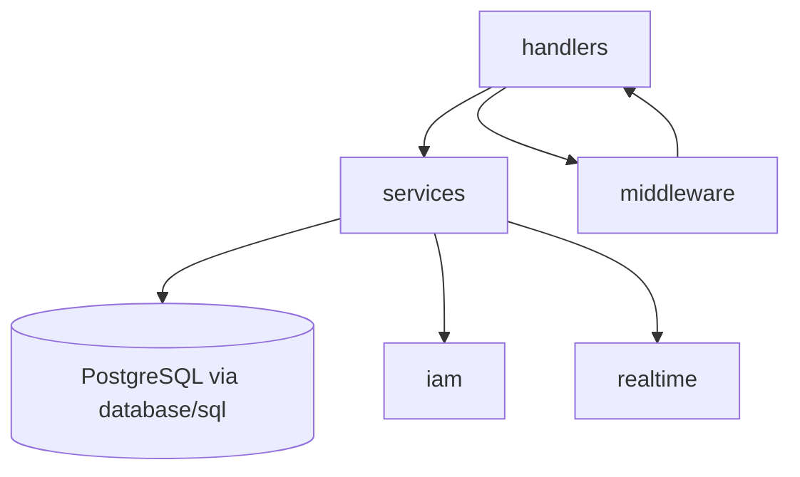
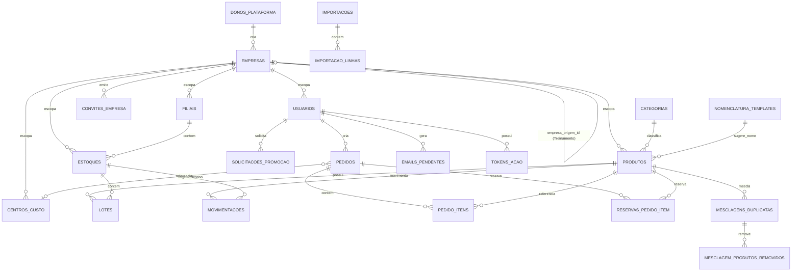

# Architecture Spine — stockflow

## Design Paradigm

**Layered Go pragmático** — sem framework web, sem ORM, sem Hexagonal/Clean Architecture. Ratificado a partir do código real do `FB_APU02` (a referência de stack explicitamente mandatada), não do PRD-fonte anterior (que assumia Hexagonal + RabbitMQ + Redis).

Camadas, mapeadas para diretórios:

- `handlers/` — fronteira HTTP. Um arquivo por domínio (produtos, estoques, movimentacoes, pedidos, auth, iam, realtime). Recebe request, valida input, chama `services/`, serializa resposta. Nunca acessa o banco diretamente.
- `services/` — regra de negócio e orquestração (validação de domínio, transações, chamadas a `iam/`, outbox de e-mail, filtro de escopo de listagem — AD-8). Recebe `*sql.DB`/`*sql.Tx` por injeção explícita (factory functions), não por container de DI.
- Acesso a dados via `database/sql` direto (queries SQL explícitas), sem ORM — mesmo padrão do `FB_APU02`.
- `middleware/` — autenticação de sessão (AD-6/AD-7) e a *decisão* de autorização por papel mínimo/relativo (AD-8, formas 1 e 2). A forma 3 (filtro de escopo em listagem) vive em `services/`, consultando o papel já resolvido pelo middleware no contexto da requisição — nunca re-derivando.
- `iam/` — integração Keycloak (AD-7), isolado dos demais domínios.
- `realtime/` — registry SSE in-process (AD-3).
- `migrations/` — SQL sequencial aplicado no startup (`golang-migrate` ou equivalente já usado no `FB_APU02`).

## Invariants & Rules



### AD-1 — Paradigma: Layered Go, sem framework/ORM

- **Binds:** todo o backend.
- **Prevents:** introdução de camadas de portas/adaptadores (Hexagonal), de um framework web (chi, gin, echo), ou de um ORM — qualquer coisa que divirja da convenção já provada no `FB_APU02`.
- **Rule:** `net/http` stdlib puro; toda query SQL é explícita em `services/` ou num pacote de repositório fino; nenhuma dependência de container de injeção de dependência.

### AD-2 — [ADOPTED] Sem Redis nem RabbitMQ

- **Binds:** toda decisão de infraestrutura deste projeto.
- **Prevents:** reintrodução de mensageria/cache externos "por via das dúvidas" — nenhuma decisão abaixo (AD-3, AD-4, AD-5) depende deles.
- **Rule:** nenhum serviço `redis` ou `rabbitmq` no `docker-compose` do stockflow. Diverge deliberadamente do `FB_APU02` (que mantém Redis não utilizado) e do PRD-fonte original (que exigia RabbitMQ).

### AD-3 — Tempo real via broadcaster in-process + SSE

- **Binds:** atualização quase em tempo real do catálogo/estoques/movimentações/pedidos (PRD §6.1, substituto do `onSnapshot` do Firestore).
- **Prevents:** introdução de Redis Pub/Sub ou WebSocket; schema de evento divergente entre features; canal não atribuído a um domínio de alta frequência; mecanismo de autenticação inconsistente entre conexões SSE.
- **Rule:**
  - Um registry in-memory (map protegido por mutex) de conexões SSE abertas por processo, com **quatro** canais de recurso: `produtos`, `estoques`, `movimentacoes`, `pedidos` (todo domínio de **alta frequência de mudança operacional**, com handler próprio, tem canal — nenhum fica implícito em outro).
  - **Exceção explícita (nesta versão):** Categorias, Templates de Nomenclatura, Filiais e Centros de Custo (`handlers/categorias.go`, `handlers/nomenclatura.go`, `handlers/filiais.go`) são config administrativa de baixa frequência — mudam raramente, via tela de admin, sem necessidade de sincronização ao vivo entre viewers concorrentes. Ficam **fora** do gerador "todo domínio com handler tem canal": sem exceção explícita, os handlers novos desta rodada implicariam canais que nunca foram implementados. Cliente sempre rebusca via GET normal após uma ação de CRUD nessas telas.
  - **Envelope de evento fixo, único para todos os canais:** `{"resource": "produtos"|"estoques"|"movimentacoes"|"pedidos", "id": "<uuid>", "change": "created"|"updated"|"deleted"}` — nenhum produtor de evento inventa campo ou vocabulário próprio. Payload sempre mínimo; cliente rebusca via GET.
  - **Autenticação da conexão SSE:** `EventSource` não permite header customizado, então a sessão (AD-6/AD-7) não se aplica diretamente. Cliente autenticado obtém um *ticket* de curta duração (TTL 30s, uso único) via `POST /api/realtime/ticket` (autenticado normalmente, por cookie/Authorization); abre `GET /api/realtime/stream?ticket=...` com esse ticket na query string. Ticket expira em 30s ou no primeiro uso — nunca o token de sessão em si aparece em query string/log.
  - Ao reconectar, cliente sempre faz um GET completo ao recurso, nunca replay de eventos perdidos.
  - **Constraint:** só correto com uma única instância da aplicação; escalar horizontalmente exige revisitar esta decisão (Redis Pub/Sub volta à mesa — ver Deferred).

### AD-4 — E-mail assíncrono via outbox Postgres, com contrato de linha fixo

- **Binds:** envio de e-mail transacional (verificação de conta FR-3, redefinição de senha FR-32).
- **Prevents:** chamada SMTP síncrona dentro do handler HTTP; perda de e-mail em caso de restart; dois produtores assumindo formatos de linha incompatíveis para o mesmo worker.
- **Rule:** toda escrita que precisa enviar e-mail insere um registro na tabela `emails_pendentes` na MESMA transação da escrita de negócio, com **schema fixo**: `destinatario`, `tipo` (enum: `verificacao_conta` | `redefinicao_senha`), `variaveis_json` (jsonb com os dados para o template — nunca corpo HTML pré-renderizado pelo produtor). Um único worker goroutine consome por polling, resolve o template pelo `tipo`, renderiza e envia, marcando `enviado`/`falho` com retry.

### AD-5 — Papel do Usuário sempre lido do Postgres, sem cache

- **Binds:** autorização por papel (FR-2) e revogação imediata de acesso (FR-31).
- **Prevents:** cache de papel desatualizado permitindo ação por um papel já rebaixado/desativado.
- **Rule:** middleware de autorização consulta `usuarios.papel` diretamente no Postgres a cada requisição autenticada — nenhum cache em memória ou Redis. Simplicidade e correção imediata priorizadas sobre latência marginal (volume de ferramenta interna, não alto-QPS).

### AD-6 — Modelo de sessão: access curto + refresh rotativo (TTL 2h)

- **Binds:** login por senha (FR-1).
- **Prevents:** dois mecanismos de sessão divergentes entre o caminho de senha e o caminho SSO (AD-7).
- **Rule:** JWT de acesso curto (30min, `golang-jwt/jwt/v5`, mesma lib do `FB_APU02`) + refresh token rotativo em cookie `HttpOnly`, TTL de **2h** (não 7 dias como no `FB_APU02` — ajustado para expressar "expira por inatividade" de FR-1). Refresh rotaciona a cada uso, deslizando a janela de 2h.

### AD-7 — [ADOPTED] Keycloak SSO replicando o padrão do FB_APU02

- **Binds:** FR-34 (login federado).
- **Prevents:** reinvenção de JWKS/PKCE do zero; divergência do padrão já validado em produção; ambiguidade de conta por e-mail duplicado (ver AD-14).
- **Rule:** pacote `iam/` dedicado — JWKS client com cache em memória (TTL 1h), validação RS256 via `kid`, `iss` = URL do realm, **`azp`** (não `aud`) contra allowlist `IAM_ALLOWED_CLIENT_IDS`, `email_verified` obrigatório, busca de Usuário por e-mail **case-insensitive** (depende de AD-14 garantir unicidade normalizada), SSO nunca cria conta nova. Endpoint de troca (`POST /api/auth/sso/keycloak`) emite os mesmos tokens do AD-6. Endpoint de config runtime (`GET /api/auth/sso/config`, não build-time). RP-initiated logout ao encerrar sessão SSO. **Divergência deliberada do `FB_APU02`:** login por senha continua sendo o caminho padrão visível na tela — sem auto-redirect para o Keycloak. Client id próprio do stockflow no realm `ferreiracosta` (não o mesmo do `FB_APU02`).

### AD-8 — [ADOPTED] Autorização por papel: decisão em middleware, escopo em service

- **Binds:** todos os endpoints (FR-2, FR-24, FR-31, FR-33).
- **Prevents:** checagem de papel ad-hoc ou esquecida num handler; ambiguidade sobre se a hierarquia de papel é ordem total ou pares explícitos.
- **Rule:**
  1. **Papel mínimo exigido por rota** e (2) **comparação relativa ao alvo da ação** são sempre decididos em `middleware/` (allow/deny, nunca no handler).
  2. **Hierarquia de papel é ordem total codificada** numa constante/tabela compartilhada: `adm=4 > gestor=3 > almoxarife=2 > usuario=1`. "Ator pode agir sobre alvo" = `rank(ator) > rank(alvo)`, sempre essa fórmula — nunca uma allow-list de pares reimplementada por feature.
  3. **Filtro de escopo em listagem** (ex. FR-24: `usuario` sem papel `almoxarife`+ recebe só os próprios pedidos, nunca 403) é necessariamente um concern de `services/` (molda a query) — consome o papel já resolvido pelo contexto de requisição que o middleware populou, nunca re-consulta ou re-deriva.

### AD-9 — [ADOPTED] Dimensões de Produto sempre estruturadas

- **Binds:** schema de `produtos`, validação de cadastro (FR-8) e importação (FR-10), Normalização (FR-17).
- **Prevents:** reintrodução de parsing de texto livre (débito técnico herdado, addendum §E.9).
- **Rule:** cada dimensão (comprimento, largura, diâmetro, altura, espessura, lateral) é um par `{valor: numeric, unidade: enum}` — nunca string livre.

### AD-10 — [ADOPTED] Concorrência e propriedade de escrita de `lotes.quantidade`

- **Binds:** débito de estoque (FR-14, FR-15, FR-25); criação de reserva de saldo (FR-22, AD-25).
- **Prevents:** saldo negativo por corrida entre transações concorrentes; deadlock por ordem de lock inconsistente num lote; um segundo caminho de escrita que não gera Movimentação, quebrando a garantia "soma de MOVIMENTACOES == quantidade atual" usada por FR-16/FR-30; duas reservas concorrentes lendo o mesmo saldo disponível como livre e travando-o duas vezes (achado do revisor adversarial da arquitetura — a leitura literal de AD-25, que reserva não escreve `quantidade`, deixava esse caminho fora do lock).
- **Rule:**
  - **Toda** escrita em `lotes.quantidade`, sem exceção — incluindo qualquer futura "correção manual de saldo" — insere uma `MOVIMENTACOES` na mesma transação (tipo `ajuste` para correções que não são baixa/transferência). Não existe caminho de escrita em `quantidade` sem uma linha de `MOVIMENTACOES` correspondente.
  - Toda escrita usa `SELECT ... FOR UPDATE` (lock pessimista) na mesma transação.
  - **Criar uma reserva (FR-22) participa do mesmo protocolo de lock, mesmo sem escrever em `lotes.quantidade`:** adquire `SELECT ... FOR UPDATE` sobre as linhas de `lotes` do(s) par(es) produto/estoque afetados antes de calcular saldo disponível (AD-25) e inserir a linha em `reservas_pedido_item`, na mesma transação. Sem isso, duas submissões concorrentes de Pedido poderiam ambas calcular saldo suficiente e reservar o mesmo saldo físico duas vezes.
  - Para transações que tocam **múltiplas** linhas `(produto_id, estoque_id)` (ex. FR-25 aprovando um Pedido com N itens, ou FR-22 reservando N itens): o conjunto completo de pares é **ordenado ascendentemente antes de adquirir qualquer lock** — nunca na ordem de inserção/exibição do carrinho. A regra de ordem canônica vale para o lote inteiro, não só par a par.
  - **Estendido nesta versão (AD-24):** com o saldo passando a ser rastreado por Lote, a ordem canônica de lock vira `(produto_id, estoque_id, lote_id)` ascendente — o terceiro nível não substitui os dois primeiros, só refina o lock para o nível em que a escrita (ou, no caso de reserva, a leitura protegida) de fato acontece.

### AD-11 — [ADOPTED] Fotos versionadas em disco, soft-delete com FK reescrita em merge

- **Binds:** FR-27, FR-28, FR-20 (mesclagem de duplicatas), FR-30/relatórios, FR-47/FR-50 (Lote e reserva de saldo).
- **Prevents:** fotos inline no banco (achado E.6 do addendum); URL de foto cacheada servindo imagem obsoleta após re-upload; histórico de Movimentações/Pedidos/Lotes/reservas de um produto mesclado ficar "preso" ao id removido e sumir de relatórios ou saldo do produto sobrevivente.
- **Rule:**
  - Fotos em volume Docker nomeado e persistente, nunca base64 inline nem storage efêmero.
  - Nome de arquivo **versionado** (`<produto_id>-<timestamp_unix>.jpg`), nunca overwrite em path fixo — evita cache de URL servindo foto antiga após re-upload.
  - `deleted_at IS NULL` em todo read de Produto.
  - **Mesclagem de duplicatas (FR-20) reescreve o `produto_id` em todas as linhas históricas de `MOVIMENTACOES`, `PEDIDO_ITENS`, `LOTES` e `RESERVAS_PEDIDO_ITEM` do produto removido para o produto sobrevivente**, antes do soft-delete — preserva "soma de MOVIMENTACOES == quantidade atual", mantém relatórios (FR-30) corretos e garante que saldo físico (AD-24) e reserva ativa (AD-25) do produto removido não fiquem órfãos sob um id soft-deleted, sem precisar atravessar lineage de merge em toda query. **Achado crítico do revisor adversarial da arquitetura:** `LOTES` e `RESERVAS_PEDIDO_ITEM` nasceram depois desta AD (AD-24/AD-25) e tinham ficado de fora da lista original — sem essa extensão, uma mesclagem faria saldo físico "sumir" e permitiria dupla-venda do saldo reservado ignorado no cálculo do sobrevivente. Produto soft-deleted nunca reentra em mesclagem, mas mantém foto em disco para auditoria permanente da mesclagem em si (`MESCLAGEM_PRODUTOS_REMOVIDOS`).

### AD-12 — [ADOPTED] Bootstrap do primeiro Adm via CLI

- **Binds:** FR-3 (provisionamento do primeiro Adm).
- **Prevents:** endpoint HTTP de auto-promoção a Adm (vetor de escalação de privilégio).
- **Rule:** comando CLI dedicado (`cmd/seed-admin`), nunca uma rota HTTP.

### AD-13 — Topologia de deployment: Compose single-host

- **Binds:** todo o runtime.
- **Prevents:** provisionamento de serviços não usados (Redis, RabbitMQ — ver AD-2); topologia divergente do padrão já operado pela empresa.
- **Rule:** Docker Compose no padrão `installer/cliente-aws` do `FB_APU02` — serviços `api` (Go), `web` (React + Nginx), `db` (`postgres:15-alpine`); volume nomeado persistente para fotos. Endereço/DNS exato do servidor: Deferred (item de infraestrutura, requer aprovação humana explícita).

### AD-14 — Convenções de nomenclatura e formato

- **Binds:** todo o schema e a API.
- **Prevents:** mistura de idioma no schema; formatos de data/erro/e-mail inconsistentes entre endpoints; vocabulário de código de erro reinventado por handler; contas duplicadas por diferença de capitalização de e-mail (quebra o lookup case-insensitive de AD-7).
- **Rule:**
  - Tabelas/colunas em português (`produtos`, `estoques`, `pedidos`, `movimentacoes`, `usuarios`, `solicitacoes_promocao`, `emails_pendentes`, ...) — nomes de domínio já estabelecidos pelo protótipo e pelo PRD; tipos/pacotes Go em inglês (convenção idiomática).
  - IDs: UUID v4 em toda tabela nova.
  - Datas: `timestamptz` UTC no banco, ISO 8601 na API.
  - **E-mail sempre normalizado para minúsculas antes de gravar** (`usuarios.email`), com índice único sobre o valor normalizado (functional unique index ou coluna `citext`) — garante que a busca case-insensitive de AD-7 nunca retorne mais de uma linha.
  - Erro HTTP: envelope `{"error": {"code": string, "message": string}}`; **vocabulário de `code` fixo para os casos de autenticação/sessão** — `TOKEN_EXPIRED`, `SESSION_REVOKED`, `FORBIDDEN`, `VALIDATION_ERROR`, `NOT_FOUND`, `CONFLICT` — nenhum endpoint inventa string própria para essas condições (o interceptor único do frontend decide retry-silencioso vs. logout com base nesse enum).
  - Logging: `log/slog` da stdlib — **escolha própria do stockflow** para atender à NFR de observabilidade estruturada (PRD §8); diverge deliberadamente do `FB_APU02`, que usa o pacote `log` não-estruturado da stdlib (verificado no código real — não é "ratificação", é decisão nova).

### AD-15 — [ADOPTED] Migração de dados legados como corte único, humano-disparado

- **Binds:** `cmd/migrate-legado`, toda a carga inicial de Produtos/Estoques/Histórico/Pedidos/Usuários/Categorias/Templates.
- **Prevents:** migração incremental/paralela não planejada; execução automática do corte por um agente autônomo.
- **Rule:** script one-off (fora do runtime da aplicação), lendo diretamente do PostgreSQL espelho do Firestore mantido pela empresa. Converte dimensões texto-livre para `{valor,unidade}` estruturado; gera UUIDs novos com tabela de mapeamento id-antigo→id-novo para preservar referências entre `PRODUTOS`/`ESTOQUES`/`MOVIMENTACOES`/`PEDIDOS`/`USUARIOS`; popula `NOMENCLATURA_TEMPLATES` (28 seeds, addendum §G) e `CATEGORIAS` (25 seeds, addendum §H). Corte único ("big-bang"), **sempre disparado por uma pessoa — nunca por um agente autônomo** (vinculante desde o PRD §9, mesmo que o restante do código seja construído sob o processo de agentes do `bmad-loop`).

### AD-16 — Envelope operacional (ambientes, segredos, backup, observabilidade, CI/CD)

- **Binds:** todo o ciclo de vida operacional do sistema.
- **Prevents:** dimensão operacional ficar completamente indecidida entre a fase de Arquitetura e o primeiro deploy real.
- **Rule** (ratificado do padrão já operado pela empresa no `FB_APU02`, salvo nota em contrário):
  - **Ambientes:** local (Docker Compose no notebook/KVM2 de desenvolvimento) e produção (servidor dedicado Ferreira Costa, padrão `cliente-aws`). Sem ambiente de staging dedicado nesta v1 — `[ASSUMPTION]`, a confirmar se o volume de mudanças justificar depois.
  - **Segredos:** variáveis de ambiente via arquivo `.env` não versionado, mesmo padrão do `FB_APU02` (`IAM_BASE_URL`, `IAM_CLIENT_ID`, etc. — nomes já listados no PRD §10). Sem gerenciador de segredos dedicado (Vault etc.) — proporcional à escala de ferramenta interna de uma única empresa.
  - **Backup:** `pg_dump` diário automatizado, mesmo padrão do `docker-compose.prod.yml` do `FB_APU02`. Retenção segue PRD §9 (12 meses para dados de negócio; backup operacional em si é uma política de infra separada — `[NOTE FOR PM]` prazo de retenção de backup a definir com quem opera o servidor).
  - **Observabilidade:** Prometheus + Grafana, mesmo padrão do `docker-compose.prod.yml` do `FB_APU02` — cobre a NFR de observabilidade estruturada do PRD §8 (junto com `log/slog`, AD-14).
  - **CI/CD:** GitHub Actions, mesmo padrão do `FB_APU02` (`.github/workflows/deploy-cliente-aws.yml` como referência) — build, teste, `docker compose pull` + restart + health check no deploy.

## Consistency Conventions

| Concern | Convention |
| --- | --- |
| Naming (entidades, tabelas, colunas) | Português, nomes já estabelecidos (AD-14); pacotes/tipos Go em inglês |
| Data & formatos (ids, datas, erro, e-mail) | UUID v4; `timestamptz` UTC; envelope de erro com vocabulário fixo de `code`; e-mail normalizado lowercase (AD-14) |
| Autorização | Decisão (allow/deny) sempre em middleware; escopo de listagem sempre em service, nunca re-derivando o papel (AD-8) |
| Escopo de Empresa | `empresa_id` resolvido uma vez no middleware a partir do slug da URL (AD-19); toda query de service filtra por ele (AD-20); nunca aceito de body/query do cliente |
| Concorrência e propriedade de escrita | `SELECT ... FOR UPDATE` + ordem `(produto_id, estoque_id, lote_id)` ascendente, inclusive na criação de reserva (não só na escrita de `quantidade`) (AD-10); toda escrita em `quantidade` gera Movimentação, sem exceção (AD-10); saldo disponível sempre calculado contra reserva, nunca coluna materializada (AD-25); consumo de Lote é sempre FEFO, nunca escolha manual (AD-24) |
| Tempo real | Envelope de evento fixo, um canal por domínio, autenticação via ticket de curta duração (AD-3) |
| Logging | `log/slog` estruturado, nunca `fmt.Print` (AD-14) |
| Sessão/autenticação | AD-6 (senha) e AD-7 (SSO) emitem o mesmo formato de token — nenhum handler decide sessão por conta própria |

## Stack

| Name | Version |
| --- | --- |
| Go | **1.27** — atualizado deliberadamente a partir da referência do `FB_APU02` (1.22.0, sem suporte de segurança desde ~fev/2025); demais convenções (stdlib `net/http`, sem ORM) continuam ratificadas |
| PostgreSQL | 15 (`postgres:15-alpine`, ratificado do `FB_APU02` — dentro da janela de suporte até ~nov/2027) |
| golang-jwt/jwt | v5 (ratificado do `FB_APU02`, confirmado ativamente mantido em 2026) |
| signintech/gopdf | verificar versão exata no `go.mod` na implementação (FR-26) — escolhida em 2026-08-29 após pesquisa web: `gofpdf`/`go-pdf/fpdf` arquivados, Maroto v2 depende transitivamente de `gofpdf` arquivado |
| qax-os/excelize v2 | v2.11.0 confirmado ativamente mantido (2026-08-29) — biblioteca de exportação Excel (FR-30) |
| React | **19.2.x** — atualizado deliberadamente a partir da referência do `FB_APU02` (18.3.1) |
| TypeScript | **7.0.x** — atualizado deliberadamente (compilador novo em Go, builds mais rápidos) |
| Vite | **8.0.x** — atualizado deliberadamente (bundler Rolldown) |
| React Router DOM | 6.x (ratificado do `FB_APU02`) |
| TanStack Query | 5.x (ratificado do `FB_APU02`, confirmado current) |
| shadcn/ui + Tailwind CSS | ratificado do `FB_APU02`, confirmado ativamente desenvolvido em 2026 |
| Biblioteca TOTP (FR-37, MFA) | **não vinculada nesta spine** — `pquerna/otp` é candidata, mas seu status de manutenção em 2026 não foi confirmado nesta pesquisa; verificar no momento da story (ver Deferred) |

## Structural Seed

```text
backend/
  main.go            # bootstrap, registro de rotas, migrations
  handlers/           # um arquivo por domínio — fronteira HTTP (AD-1)
  services/           # regra de negócio, transações, outbox de e-mail, filtro de escopo (AD-1, AD-4, AD-8)
  middleware/          # autenticação de sessão (AD-6/AD-7), decisão de autorização (AD-8)
  iam/                # integração Keycloak (AD-7)
  realtime/            # registry SSE in-process, tickets de conexão (AD-3)
  migrations/          # SQL sequencial aplicado no startup
  cmd/
    seed-admin/         # bootstrap do primeiro Adm (AD-12)
    migrate-legado/      # script one-off de migração de dados (AD-15)
    seed-dono-plataforma/  # bootstrap do primeiro Dono da Plataforma (AD-21)
frontend/
  src/
    pages/              # uma página por rota
    contexts/            # AuthContext (AD-6/AD-7), etc.
    lib/keycloak/         # fluxo Authorization Code + PKCE (AD-7)
    lib/realtime/          # cliente SSE, obtenção de ticket (AD-3)
```



*Nota: `PRODUTOS`, `ESTOQUES`, `MOVIMENTACOES`, `PEDIDOS`, `PEDIDO_ITENS`, `CATEGORIAS`, `LOGS_ACESSO`, `SOLICITACOES_PROMOCAO`, `MESCLAGENS_DUPLICATAS`, `IMPORTACOES`, `NOMENCLATURA_TEMPLATES`, `LOTES`, `FILIAIS`, `CENTROS_CUSTO` e `RESERVAS_PEDIDO_ITEM` também carregam `empresa_id` (AD-20) — omitido do diagrama acima por brevidade, já que toda tabela de domínio é escopada da mesma forma. `LOTES` substitui `PRODUTO_ESTOQUE` (AD-24). `CONTADORES_PRODUTO` (AD-26) tem `empresa_id` como chave primária — sem `id` próprio — e por isso fica fora do diagrama de relacionamentos.*

## Capability → Architecture Map

| Capability / Área | Vive em | Governado por |
| --- | --- | --- |
| Autenticação por senha (FR-1) | `handlers/auth.go`, `middleware/` | AD-6 |
| Autorização por papel (FR-2, FR-24, FR-31, FR-33) | `middleware/`, `services/` | AD-8, AD-5 |
| Autocadastro (FR-3) | `handlers/auth.go`, `services/` | AD-6, AD-4 (e-mail de verificação), AD-14 (e-mail normalizado) |
| Bloqueio/senha (FR-36) | `middleware/`, `services/` | Ver Deferred — nenhuma AD dedicada de contador/lockout ainda |
| MFA administrativo (FR-37) | `services/`, biblioteca TOTP | Ver Deferred (biblioteca não vinculada) |
| Log de acesso (FR-38) | `services/`, tabela `logs_acesso` | AD-14 (formato) |
| LGPD (FR-39) | `services/` | AD-14 (formato de exportação) |
| SSO Keycloak (FR-34) | `iam/`, `handlers/auth_sso.go` | AD-7, AD-14 (e-mail normalizado) |
| Catálogo/busca (FR-4–7, FR-35) | `handlers/produtos.go`, `services/` | AD-1, AD-9 |
| Cadastro/importação (FR-8–11, FR-45–46) | `handlers/produtos.go`, `services/`, `IMPORTACOES`/`IMPORTACAO_LINHAS`, `CONTADORES_PRODUTO` | AD-9, AD-26, AD-30, AD-32, AD-34 |
| CRUD de Categorias/Templates (FR-48–49) | `handlers/categorias.go`, `handlers/nomenclatura.go`, `services/` | AD-20 (cópia por Empresa), AD-33 |
| Gestão de Estoques e Filiais (FR-12–13, FR-51) | `handlers/estoques.go`, `handlers/filiais.go`, `FILIAIS` | AD-1, AD-27, AD-31 |
| Movimentação e Lote (FR-14–16, FR-47) | `handlers/movimentacoes.go`, `LOTES` | AD-10, AD-24 |
| Normalização (FR-17–20) | `handlers/normalizacao.go` | AD-9, AD-11 |
| Pedidos e reserva de saldo (FR-21–25, FR-50, FR-52) | `handlers/pedidos.go`, `RESERVAS_PEDIDO_ITEM`, `CENTROS_CUSTO` | AD-10, AD-25, AD-28 |
| Recibo PDF (FR-26) | `handlers/pedidos.go`, `signintech/gopdf` | AD-17 |
| Fotos (FR-27–29) | `handlers/produtos.go`, volume de disco | AD-11 |
| Exportação Excel (FR-30) | `services/relatorios.go`, `qax-os/excelize` | AD-1, Stack |
| Tempo real (todas as features acima) | `realtime/` | AD-3 |
| Migração de dados legados | `cmd/migrate-legado` | AD-15 |
| Operação (ambientes, backup, CI/CD, observabilidade) | infraestrutura, `.github/workflows` | AD-13, AD-16 |
| Isolamento por Empresa (FR-40) | `middleware/`, `services/` (toda tabela de domínio) | AD-19, AD-20 |
| Gestão de Empresas (FR-41) | `handlers/empresas.go`, `handlers/plataforma_auth.go`, tabela `donos_plataforma` | AD-21 |
| Convite/vínculo a Empresa (FR-42) | `handlers/convites.go`, `services/`, tabela `convites_empresa` | AD-22, AD-14 (e-mail normalizado) |
| Ambiente de Treinamento (FR-43) | `services/empresas.go` (provisionamento), tabela `empresas` | AD-23, AD-20 |
| Migração multi-Empresa (FR-44) | `cmd/migrate-empresa` ou migration SQL + script de backfill | AD-20 |

### AD-17 — Recibo PDF sempre renderiza do snapshot em PEDIDO_ITENS

- **Binds:** FR-26.
- **Prevents:** dois documentos do mesmo Pedido divergindo entre si conforme o momento da geração (download sob demanda vs. anexo em e-mail), caso o Produto seja editado depois do Pedido criado.
- **Rule:** o PDF do recibo é sempre renderizado a partir dos campos já capturados em `PEDIDO_ITENS` no momento do envio/aprovação (nome, unidade, estoque, quantidade, categoria) — nunca faz join ao vivo com `PRODUTOS` para buscar dado atual. Vale tanto para o download sob demanda quanto para qualquer anexo futuro.

### AD-18 — TOKENS_ACAO tipado e de uso único

- **Binds:** FR-3 (verificação de e-mail), FR-32 (redefinição de senha).
- **Prevents:** um token de verificação de conta ainda válido ser aceito por engano no endpoint de redefinição de senha (confusão de fluxo entre dois usos do mesmo mecanismo).
- **Rule:** `TOKENS_ACAO` tem coluna `tipo` (enum: `verificacao_email` | `redefinicao_senha`). Validação sempre filtra por `token + usuario_id + tipo + não expirado + não usado`; token é marcado usado (ou apagado) atomicamente na primeira validação bem-sucedida — nunca reutilizável, nunca aceito por um fluxo diferente do que o gerou.

### AD-19 — Empresa resolvida no middleware por slug de URL, nunca re-derivada

- **Binds:** FR-40 a FR-44 (Multi-Empresa) — toda rota autenticada de Usuário/`adm`.
- **Prevents:** dois services decidindo "qual Empresa" de formas incompatíveis (um lendo do e-mail, outro de um header); ambiguidade de login com e-mail não mais globalmente único (FR-42); reintrodução de subdomínio/DNS wildcard não planejado para esta fase.
- **Rule:** URL de acesso carrega um path prefix com o slug da Empresa (ex. `/e/ferreira-costa/...`); `middleware/` resolve `empresa_id` a partir desse slug **uma vez**, popula o contexto da requisição junto com o papel já resolvido (mesmo padrão de AD-8) — nenhum `service` re-deriva ou aceita `empresa_id` vindo de body/query. Login (FR-1, FR-34) e todo endpoint de domínio vivem sob esse prefixo. Divergência deliberada de um subdomínio por Empresa (mais comum no mercado, `addendum.md` §I): exigiria DNS wildcard + certificado wildcard, infraestrutura nova incompatível com a urgência da V1 e com AD-13 (single-host simples); o path prefix funciona sobre a infraestrutura HTTP já existente sem mudança de DNS/certificado.

### AD-20 — Isolamento por Empresa via `empresa_id` em toda tabela de domínio, migração aditiva

- **Binds:** FR-40, SM-7 — Catálogo, Estoques, Movimentações, Pedidos, Categorias, Log de Acesso, Normalização/Duplicatas, Gestão de Contas/Promoção; FR-44 (migração da Ferreira Costa).
- **Prevents:** uma área nova (ou uma query de relatório/agregação futura) esquecer o filtro de Empresa e vazar dado entre clientes; a migração da Ferreira Costa travar o sistema em produção ou ficar num estado parcial sem caminho de retomada; um `filial_id`/`centro_custo_id` de outra Empresa sendo aceito porque a FK do banco, sozinha, não garante isolamento cross-Empresa.
- **Rule:**
  - Coluna `empresa_id UUID NOT NULL REFERENCES empresas(id)` em toda tabela de domínio (`produtos`, `estoques`, `movimentacoes`, `pedidos`, `pedido_itens`, `categorias`, `logs_acesso`, `solicitacoes_promocao`, `mesclagens_duplicatas`, `mesclagem_produtos_removidos`, `importacoes`, `nomenclatura_templates`, `convites_empresa`, `lotes`, `reservas_pedido_item`, `filiais`, `centros_custo`) e em `usuarios`. **Exceção:** `contadores_produto` usa `empresa_id` como chave primária própria (AD-26), não como coluna de filtro adicional. **Achado do revisor adversarial da arquitetura:** esta lista tinha ficado presa às tabelas anteriores à Multi-Empresa/Lote — atualizada aqui para as 6 tabelas novas desta rodada e as de AD-21/22.
  - Toda query de `service` que lê ou escreve uma dessas tabelas inclui `WHERE empresa_id = $1` (ou equivalente na escrita) usando o `empresa_id` do contexto da requisição (AD-19) — nunca um `service` monta uma query sem essa cláusula, nem mesmo em agregações/relatórios.
  - **FK para tabela escopada por Empresa, recebida do cliente, é sempre revalidada contra a Empresa do contexto antes de aceitar:** um `filial_id` (FR-51) ou `centro_custo_id` (FR-52) enviado no corpo de uma requisição só é aceito se a linha referenciada tiver o mesmo `empresa_id` do contexto (AD-19) — a FK do banco por si só não impede que um `filial_id`/`centro_custo_id` de outra Empresa seja aceito silenciosamente. Mesma disciplina de "nunca confiar em id de escopo vindo do cliente" já aplicada ao próprio `empresa_id`.
  - **Migração da Ferreira Costa (FR-44) é aditiva em duas fases, nunca um único `ALTER ... NOT NULL` direto sobre produção viva:** (1) coluna `empresa_id` nasce `NULL`able, backfill em lote (resumível — reexecutar não duplica, não perde linha, idempotente por chave primária já existente) atribuindo o id da Empresa "Ferreira Costa" a toda linha hoje sem dono; (2) só depois de backfill 100% confirmado, `ALTER COLUMN empresa_id SET NOT NULL` + índice. Sem downtime obrigatório entre as duas fases — a aplicação continua servindo tráfego normalmente enquanto a coluna ainda aceita `NULL`.
  - `adm` (AD-8) deixa de ser único globalmente e passa a ser único por `empresa_id` — índice único parcial trocado de `WHERE papel='adm'` para `WHERE papel='adm'` particionado por `empresa_id` (ex. índice único composto `(empresa_id) WHERE papel='adm'`).

### AD-21 — "Dono da Plataforma" em tabela própria, disjunta de `usuarios`

- **Binds:** FR-41.
- **Prevents:** a identidade mais privilegiada do sistema colapsar com a de um `adm` de Empresa (achado da revisão adversarial do PRD); alguém estender a escala de rank de AD-8 (`adm=4 > gestor=3 > ...`) com um quinto nível para este papel, misturando uma hierarquia intra-Empresa com um papel que é cross-Empresa por definição.
- **Rule:** tabela `donos_plataforma` (id, e-mail, senha_hash, mfa_habilitado, mfa_secret — mesmo formato de MFA de `usuarios`/AD-8, nunca opcional aqui), completamente disjunta de `usuarios`. Rota de login própria (`POST /api/plataforma/auth/login`, fora do prefixo `/e/{slug}` de AD-19). Primeiro registro em `donos_plataforma` é bootstrap por CLI (mesmo padrão de AD-12) — nenhuma rota HTTP cria a primeira linha dessa tabela. Rotas de gestão de Empresas (criar Empresa + primeiro `adm`) exigem sessão autenticada de `donos_plataforma`, nunca aceitam elevação a partir de uma sessão de `usuarios`. Formato de token reaproveita AD-6 (JWT curto + refresh rotativo) — só o *sujeito* do token (linha de `donos_plataforma`, não de `usuarios`) e a rota de emissão mudam, nunca dois formatos de sessão divergentes.

### AD-22 — Convite de acesso: tabela própria, nominal e de uso único

- **Binds:** FR-42.
- **Prevents:** um link de convite genérico e reutilizável permitindo autocadastro por qualquer pessoa que o obtenha (achado da revisão adversarial); confusão com o mecanismo de `TOKENS_ACAO` (AD-18), que pressupõe um `usuario_id` já existente.
- **Rule:** tabela `convites_empresa` (id, empresa_id, email, token, expira_em, usado_em, criado_por) — mesmo espírito de AD-18 (tipado, uso único, expira) mas tabela separada porque não existe `usuario_id` no momento da criação do convite. Autocadastro (FR-3) a partir de um convite só é aceito se o e-mail do formulário bater exatamente com `convites_empresa.email`; convite marcado `usado_em` atomicamente na primeira criação de conta bem-sucedida, nunca reutilizável depois.

### AD-23 — Ambiente de Treinamento é uma Empresa comum, sem código de isolamento separado

- **Binds:** FR-43.
- **Prevents:** um segundo mecanismo de isolamento construído só para "empresas de treinamento", divergindo de AD-20 e duplicando superfície de risco de vazamento.
- **Rule:** `empresas.empresa_origem_id UUID NULL REFERENCES empresas(id)` — `NULL` para uma Empresa real, preenchido com o id da Empresa real quando a linha é um Ambiente de Treinamento. Todo o resto (isolamento AD-20, resolução de slug AD-19, papéis intra-Empresa AD-8) trata a Empresa de Treinamento exatamente como trataria uma segunda Empresa de cliente qualquer — nenhuma condicional `if eh_treinamento` em `service` algum.

### AD-24 — Consumo de Lote é FEFO automático, sem escolha manual

- **Binds:** FR-47, FR-14, FR-15, FR-25.
- **Prevents:** dois consumos concorrentes escolhendo Lotes diferentes do mesmo Produto/Estoque; dois builders implementando FEFO com critério de ordenação divergente (um por `data_validade`, outro por `criado_em`).
- **Rule:** nova tabela `lotes` (`id` UUID, `produto_id`, `estoque_id`, `quantidade`, `data_validade` `NULL`able, `empresa_id`, `criado_em`) **substitui `produto_estoque`** — deixa de existir uma linha única por par Produto/Estoque; passam a existir N linhas (uma por Lote), e a quantidade do par é a soma delas (AD-29). Migração: cada linha hoje existente em `produto_estoque` vira um "Lote legado" em `lotes` com `data_validade = NULL`, preservando a quantidade atual — mesmo tratamento de AD-30. **`lotes.empresa_id` é copiado diretamente de `produto_estoque.empresa_id` da linha de origem, nunca recalculado** — a migração aditiva de `empresa_id` (AD-20/FR-44, Story 9.4) já rodou e concluiu em produção antes desta rodada, então não há corrida real entre as duas migrações; a cópia direta remove a ambiguidade para quem ler esta AD sem esse histórico (achado do revisor adversarial da arquitetura). Toda Baixa (FR-14), Transferência (FR-15) e aprovação de Pedido (FR-25) debita automaticamente do(s) Lote(s) do par Produto/Estoque com `data_validade` mais próxima primeiro (`ORDER BY data_validade NULLS LAST, criado_em ASC`) — Lote sem validade conhecida só é consumido depois de esgotados os Lotes com validade real. Nenhuma tela ou endpoint expõe escolha manual de qual Lote consumir. Estende a ordem canônica de lock de AD-10 para `(produto_id, estoque_id, lote_id)`.
- **Rationale (Deferred no PRD §11.17, fechado aqui):** FEFO automático é o próprio motivo de existir do Lote — reduzir perda por vencimento; nenhum caso de uso do PRD pede pular um Lote mais velho por um mais novo, e dar escolha manual sem necessidade real só adicionaria UI e carga cognitiva ao Almoxarife.

### AD-25 — Reserva de saldo sem expiração automática; saldo disponível é sempre query, nunca coluna

- **Binds:** FR-50, FR-14, FR-15, FR-22, FR-25.
- **Prevents:** dois mecanismos divergentes de "saldo disponível" (um contando reserva, outro não) — o achado da revisão adversarial do PRD de que Baixa/Transferência furavam a garantia de FR-50; reintrodução da race condition que FR-50 fechou, via expiração automática mal desenhada.
- **Rule:** nova tabela `reservas_pedido_item` (`id`, `pedido_id`, `produto_id`, `estoque_id`, `quantidade`, `empresa_id`) — não uma coluna em `pedido_itens`, para o ciclo de vida da reserva ser independente do item. **Saldo disponível é sempre calculado (soma de `lotes.quantidade` menos soma de `reservas_pedido_item.quantidade` ativas), nunca uma coluna materializada** — Baixa, Transferência e aprovação de Pedido (AD-24) sempre revalidam contra esse cálculo, nunca contra o saldo bruto do Lote. Reserva nasce no envio do Pedido (FR-22) e só é liberada por decisão explícita (aprovar/rejeitar/parcial, FR-25) — **sem job, cron ou expiração automática nesta versão.**
- **Rationale (Deferred no PRD §11.19, fechado aqui):** expiração automática exigiria um mecanismo assíncrono novo (hoje só existe o worker de e-mail, AD-4) e a pergunta "o que fazer com o Pedido quando a reserva expira" não tem resposta óbvia (auto-rejeitar reabre a race; deixar pendente sem reserva também). Pedido preso é resolvido por decisão humana, que já libera a reserva — sem mecanismo novo. Revisitar se pedidos presos virarem problema operacional real (ver Deferred).

### AD-26 — Código sequencial de Produto: contador atômico por Empresa

- **Binds:** FR-8.
- **Prevents:** uma `sequence` nativa do Postgres (objeto de schema fixo, não segmentável por Empresa sem DDL dinâmico em runtime) vazando, entre Empresas, uma pista de quantos Produtos a outra já tem; dois builders implementando o contador de formas incompatíveis (um com `SELECT COUNT(*)`, sujeito a corrida); bootstrap não-atômico da primeira linha do contador de uma Empresa nova gerando código duplicado no primeiro Produto cadastrado.
- **Rule:** nova tabela `contadores_produto` (`empresa_id` PK, `proximo_valor`), incrementada atomicamente via `UPDATE contadores_produto SET proximo_valor = proximo_valor + 1 WHERE empresa_id = $1 RETURNING proximo_valor`, na MESMA transação do `INSERT` em `produtos`. Código final formatado com zero-padding de 6 dígitos (`000001`). Sequência é por Empresa, nunca compartilhada — consistente com o isolamento total de AD-20. **Refinado em 2026-09-21 (sugestão do usuário):** o próximo número é `GREATEST(contador, maior código puramente numérico já existente na Empresa) + 1`, calculado dentro do mesmo `UPDATE` — código legado ou importado por planilha nunca colide com a sequência; o `UPDATE` continua travando a linha do contador, então o `MAX()+1` não sofre a corrida que motivou o contador. **A primeira linha de `contadores_produto` (`proximo_valor = 1`) nasce na MESMA transação de `ProvisionarEmpresa` que já cria a Filial padrão (AD-27)** — nunca via lazy-init/`INSERT ... ON CONFLICT` no momento do primeiro Produto. Achado do revisor adversarial da arquitetura: AD-27 já era explícita sobre bootstrap atômico da Filial padrão, mas esta AD não era — mesmo padrão aplicado aqui para fechar a mesma classe de risco.

### AD-27 — Estrutura Filial > Estoque, migração aditiva

- **Binds:** FR-51, FR-12.
- **Prevents:** Estoque órfão de Filial; dois builders inventando mecanismos divergentes de "Filial padrão" para dado já em produção.
- **Rule:** nova tabela `filiais` (`id` UUID, `empresa_id`, `nome`, `criado_em`); `estoques` ganha `filial_id UUID REFERENCES filiais(id)` — migração aditiva no mesmo molde de AD-20 (`NULL`able → backfill de uma Filial padrão única por Empresa já existente → `SET NOT NULL`). Índice único de nome de Estoque muda de `(empresa_id, nome_normalizado)` para `(filial_id, nome_normalizado)` — duas Filiais da mesma Empresa podem ter cada uma um Estoque de mesmo nome. Toda Empresa nova (FR-41, provisionamento da Story 9.2) ganha uma Filial padrão automática (nome = Nome Fantasia da Empresa) na MESMA transação de `ProvisionarEmpresa` — nenhum Estoque nasce sem Filial, nenhum passo extra de onboarding é necessário.

### AD-28 — Centro de Custo/Destino de Obra coexiste com o texto livre, não o substitui

- **Binds:** FR-52, FR-22.
- **Prevents:** dois builders decidindo divergentemente se o campo estruturado substitui o texto livre; quebra de FR-22 (Pedido sempre exige obra/centro de custo) caso a lista estruturada esteja vazia no dia 1.
- **Rule:** nova tabela `centros_custo` (`id`, `empresa_id`, `nome`); `pedidos.obra_centro_custo` (texto livre, já existente) permanece inalterado e continua obrigatório. Novo campo opcional `pedidos.centro_custo_id UUID NULL REFERENCES centros_custo(id)` — quando presente, é a referência estruturada; os dois coexistem, sem migração retroativa de Pedido histórico.
- **Rationale (Deferred no PRD §11.18, fechado aqui):** coexistir é o caminho aditivo já estabelecido pelo resto do sistema (AD-20); substituir no dia 1 quebraria o cadastro de Pedido enquanto a lista de Centros de Custo estiver vazia. Migração para obrigatório fica Deferred, decisão de produto para quando a lista estiver populada.

### AD-29 — Produto sem saldo aparece no Catálogo com quantidade zero

- **Binds:** FR-6, FR-5, FR-8.
- **Prevents:** um segundo mecanismo de ocultação (ex. status "rascunho") duplicando o que o filtro de disponibilidade (FR-5) já resolve.
- **Rule:** Produto sem nenhuma linha em `lotes` aparece normalmente no Catálogo com quantidade total 0 — nenhum estado de visibilidade novo é criado; quem não quer ver Produto sem saldo já usa o filtro "com estoque" existente.

### AD-30 — Importação em massa gera Lote sem validade, mesmo tratamento do dado migrado

- **Binds:** FR-10, FR-47.
- **Prevents:** dois caminhos divergentes de "Lote sem validade conhecida" — um para a migração da Ferreira Costa, outro para importação em massa.
- **Rule:** toda linha de planilha (FR-10) que cria ou atualiza saldo gera automaticamente uma linha em `lotes` com `data_validade = NULL` — a planilha padronizada não ganha colunas novas de Lote/Validade nesta versão (mesmo tratamento do saldo legado migrado da Ferreira Costa, FR-44).

### AD-31 — Exclusão de Estoque bloqueada por Lote residual (mesmo zerado) ou reserva ativa `[ASSUMPTION]`

- **Binds:** FR-13, AD-24, AD-29.
- **Prevents:** exclusão de Estoque apagar silenciosamente o histórico de Lote (mesmo a quantidade zero) ou deixar uma `RESERVAS_PEDIDO_ITEM` ativa apontando para um Estoque que não existe mais; dois builders decidindo divergentemente se "saldo residual" inclui Lote zerado e reserva ativa, ou só quantidade física positiva.
- **Rule:** exclusão de Estoque (FR-13) é bloqueada se existir **qualquer** linha em `lotes` para esse Estoque — mesmo com `quantidade = 0` — OU qualquer `reservas_pedido_item` ativa referenciando um Lote desse Estoque. Uma linha de Lote a quantidade zero nunca é apagada automaticamente (mesmo espírito de preservação de histórico de AD-11) — fica mantida, zerada, como registro de que aquele par Produto/Estoque já teve saldo.
- **Rationale (Deferred no PRD, fechado aqui):** `[ASSUMPTION]` fast-path — nenhuma FR ou AD anterior decidia isso; achado crítico do revisor adversarial da arquitetura (FR-13 × AD-24/AD-29 sem interação definida). Bloquear é o lado seguro: permitir exclusão com histórico presente arriscaria perda silenciosa de rastreabilidade de Lote, que é justamente o problema que FR-47 nasceu para resolver. A confirmar com o usuário na triagem.

### AD-32 — Código do Fornecedor/EAN-13 e Unidade de Medida/Embalagem: colunas simples, migração aditiva só onde obrigatório

- **Binds:** FR-45, FR-46.
- **Prevents:** confundir Código do Fornecedor/EAN-13 (FR-45) com o "Código de Identificação" interno de FR-8/FR-35 — são três campos disjuntos, sem relação funcional; builder tratando `unidade_medida` como obrigatória para Produto legado e travando o sistema por dado incompleto.
- **Rule:**
  - `produtos.codigo_fornecedor` (texto livre) e `produtos.ean13` (`CHAR(13)`, validado por dígito verificador quando informado) — ambos opcionais, sem índice de unicidade (FR-45 explícito: nenhuma garantia de unicidade nesta versão).
  - `produtos.unidade_medida` (enum já especificado em `addendum.md` §F, nunca implementado) e `produtos.embalagem` (texto livre, ex. "CX 24") — `unidade_medida` obrigatória só para Produto **novo**; migração aditiva (mesmo molde de AD-20/AD-24): coluna nasce `NULL`able, backfill em lote com valor único (`[ASSUMPTION]` "un", a confirmar) para todo Produto já existente sem essa informação, só então validação de obrigatoriedade passa a valer no cadastro/edição.
  - Ambos os pares aparecem como colunas próprias no Catálogo (FR-6) e no detalhe por Estoque (FR-7) — sem transformação, exibição direta.

### AD-33 — CRUD de Categorias e Templates: exclusão bloqueada por referência, edição nunca retroativa

- **Binds:** FR-48, FR-49.
- **Prevents:** exclusão de Categoria/Template referenciado por Produto quebrando a integridade referencial ou um relatório existente (mesmo classe de risco que AD-31 fecha para Estoque); edição de Template forçando reedição em massa de Produtos já cadastrados sob o padrão antigo.
- **Rule:**
  - Exclusão de Categoria (FR-48) ou Template (FR-49) é bloqueada se existir qualquer `produtos.categoria_id`/`produtos.template_id` apontando para a linha — mesmo princípio de AD-31 (FR-13/Estoque), agora estendido às duas listas administráveis.
  - `categorias.codigo` até 8 caracteres, `categorias.nome`/descrição até 50 — constraint de tamanho aplicada no banco, não só na validação de handler.
  - Editar um Template já em uso **não** revalida retroativamente os Produtos que já usam esse padrão — a nova regra só se aplica no próximo cadastro/edição de nome desse Produto (mesmo espírito não-retroativo de FR-9/AD-34).
  - Ambas seguem a cópia editável independente por Empresa já estabelecida em AD-20/FR-40 — sem AD nova para isso, é a mesma regra de sempre se aplicando a mais duas tabelas.

### AD-34 — Template "Genérico" `[NOME LIVRE]` é caso especial no motor de validação, não mais um template estrutural

- **Binds:** FR-9.
- **Prevents:** um builder implementando a obrigatoriedade de template (FR-9) sem perceber que o próprio fallback "Genérico" precisa ser aceito pelo motor de validação apesar de não ter estrutura de tokens nenhuma — rejeitaria o próprio mecanismo criado para cobrir as ~16/25 categorias sem template real (achado do reconhecimento adversarial do PRD, addendum §G/§H).
- **Rule:** seed de `nomenclatura_templates` inclui uma linha `Genérico` com marcador `[NOME LIVRE]` em vez de uma sequência de tokens estruturados. Motor de validação trata esse marcador como caso especial: aceita qualquer texto não vazio, sem checagem de ordem/presença de token — todo outro template continua validado estruturalmente como hoje. Seleção de template continua obrigatória (FR-9); "Genérico" é sempre uma opção disponível: a Empresa **nunca fica sem template-marcador `[NOME LIVRE]`** — o CRUD (Story 10.6, AD-33) bloqueia excluir ou trocar o texto do ÚLTIMO marcador (contagem sob `SELECT ... FOR UPDATE` ordenado, para duas exclusões simultâneas não apagarem os dois). Havendo mais de um marcador, qualquer um pode ser excluído/alterado. *(Texto ajustado pelo code review dos Épicos 10-12, 2026-09-21: a versão original dizia "nunca removível", mais forte que o código e que o AC do epics.)*

## Deferred

- **Contador/bloqueio de força bruta (FR-36) e biblioteca TOTP (FR-37):** mecanismo de contagem de tentativas/duração de bloqueio e a biblioteca TOTP não foram fixados nesta spine — `pquerna/otp` é candidata, mas não teve manutenção ativa confirmada nesta pesquisa; escolher e verificar no momento da story.
- **Endereço/DNS e provisionamento real do servidor Ferreira Costa; client id definitivo no realm Keycloak `ferreiracosta`:** infraestrutura real, requer aprovação humana explícita (PRD §11, perguntas 5 e 6).
- **Escala horizontal (múltiplas instâncias da aplicação):** fora de escopo agora (AD-13 assume single-host); se necessário no futuro, revisitar AD-3 (Redis Pub/Sub) e AD-5 (cache de papel).
- **Escopo exato de "configurar tudo" do papel `adm`:** ainda genérico no PRD (§11, pergunta 7) — sem AD até haver capacidade concreta.
- **Ambiente de staging dedicado:** assumido ausente em v1 (AD-16); revisitar se o volume de mudanças justificar.
- **Relação com os épicos/stories já existentes no repositório `Catalogo-Obras`:** decisão de reaproveitar ou não fica para a fase de Épicos/Stories, não para esta spine.
- **Validação de CNPJ (FR-41):** algoritmo de dígito verificador é conhecido/padrão (não precisa de biblioteca externa), mas confirmar na story se algum pacote Go já maduro cobre isso (ex. `klassmann/cpfcnpj`) ou se a validação é implementada inline — decisão de implementação, não de arquitetura.
- **Rate limit de emissão de convites (AD-22) e de tentativas de login do Dono da Plataforma (AD-21):** mecanismo concreto (contador em Postgres, mesmo espírito do Deferred de FR-36) não fixado nesta rodada — resolver junto do Deferred já existente de bloqueio de força bruta.
- **Tamanho de lote do backfill de `empresa_id` (AD-20):** não fixado — depende do volume real de linhas em produção no momento da execução; decisão de implementação da story de migração, não de arquitetura.
- **Conjunto de dados de exemplo do Ambiente de Treinamento (FR-43), incluindo fotos:** quantidade/conteúdo exato dos Produtos/Estoques/fotos semeados não fixado nesta spine — decisão de conteúdo/UX, não de arquitetura. Mecanismo de seed de fotos, quando decidido, é um script one-off humano-disparado (mesmo princípio de AD-15) que faz upload pelas rotas normais de FR-27, reaproveitando o armazenamento versionado de AD-11 — sem storage novo, sem AD dedicada.
- **Expiração de reserva de saldo (AD-25):** sem mecanismo automático nesta versão — revisitar se Pedido pendente travando saldo indefinidamente virar problema operacional real (ex. relatório/alerta de Pedidos parados há N dias).
- **Substituição do texto livre de obra/centro de custo pelo cadastro estruturado (AD-28):** Deferred até a lista de Centros de Custo estar populada o bastante — decisão de produto, não de arquitetura.
- **Reorganização de Estoques legados entre Filiais reais (AD-27):** a migração cria uma única Filial padrão para todo Estoque já existente; distribuí-los entre Filiais de verdade é trabalho manual do `adm`, fora desta spine.
