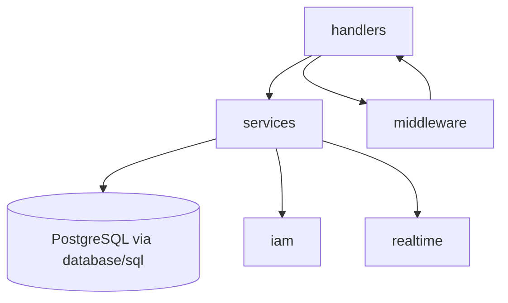
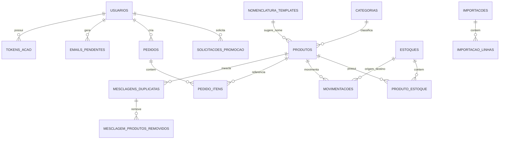

# Architecture Spine — stockflow

## Design Paradigm

**Layered Go pragmático** — sem framework web, sem ORM, sem Hexagonal/Clean Architecture. Ratificado a partir do código real do `FB_APU02` (a referência de stack explicitamente mandatada), não do PRD-fonte anterior (que assumia Hexagonal + RabbitMQ + Redis).

Camadas, mapeadas para diretórios:

- `handlers/` — fronteira HTTP. Um arquivo por domínio (produtos, estoques, movimentacoes, pedidos, auth, iam, realtime). Recebe request, valida input, chama `services/`, serializa resposta. Nunca acessa o banco diretamente.
- `services/` — regra de negócio e orquestração (validação de domínio, transações, chamadas a `iam/`, outbox de e-mail, filtro de escopo de listagem — AD-8). Recebe `*sql.DB`/`*sql.Tx` por injeção explícita (factory functions), não por container de DI.
- Acesso a dados via `database/sql` direto (queries SQL explícitas), sem ORM — mesmo padrão do `FB_APU02`.
- `middleware/` — autenticação de sessão (AD-6/AD-7) e a *decisão* de autorização por papel mínimo/relativo (AD-8, formas 1 e 2). A forma 3 (filtro de escopo em listagem) vive em `services/`, consultando o papel já resolvido pelo middleware no contexto da requisição — nunca re-derivando.
- `iam/` — integração Keycloak (AD-7), isolado dos demais domínios.
- `realtime/` — registry SSE in-process (AD-3).
- `migrations/` — SQL sequencial aplicado no startup (`golang-migrate` ou equivalente já usado no `FB_APU02`).

## Invariants & Rules



### AD-1 — Paradigma: Layered Go, sem framework/ORM

- **Binds:** todo o backend.
- **Prevents:** introdução de camadas de portas/adaptadores (Hexagonal), de um framework web (chi, gin, echo), ou de um ORM — qualquer coisa que divirja da convenção já provada no `FB_APU02`.
- **Rule:** `net/http` stdlib puro; toda query SQL é explícita em `services/` ou num pacote de repositório fino; nenhuma dependência de container de injeção de dependência.

### AD-2 — [ADOPTED] Sem Redis nem RabbitMQ

- **Binds:** toda decisão de infraestrutura deste projeto.
- **Prevents:** reintrodução de mensageria/cache externos "por via das dúvidas" — nenhuma decisão abaixo (AD-3, AD-4, AD-5) depende deles.
- **Rule:** nenhum serviço `redis` ou `rabbitmq` no `docker-compose` do stockflow. Diverge deliberadamente do `FB_APU02` (que mantém Redis não utilizado) e do PRD-fonte original (que exigia RabbitMQ).

### AD-3 — Tempo real via broadcaster in-process + SSE

- **Binds:** atualização quase em tempo real do catálogo/estoques/movimentações/pedidos (PRD §6.1, substituto do `onSnapshot` do Firestore).
- **Prevents:** introdução de Redis Pub/Sub ou WebSocket; schema de evento divergente entre features; canal não atribuído a um domínio; mecanismo de autenticação inconsistente entre conexões SSE.
- **Rule:**
  - Um registry in-memory (map protegido por mutex) de conexões SSE abertas por processo, com **quatro** canais de recurso: `produtos`, `estoques`, `movimentacoes`, `pedidos` (todo domínio com handler próprio tem canal — nenhum fica implícito em outro).
  - **Envelope de evento fixo, único para todos os canais:** `{"resource": "produtos"|"estoques"|"movimentacoes"|"pedidos", "id": "<uuid>", "change": "created"|"updated"|"deleted"}` — nenhum produtor de evento inventa campo ou vocabulário próprio. Payload sempre mínimo; cliente rebusca via GET.
  - **Autenticação da conexão SSE:** `EventSource` não permite header customizado, então a sessão (AD-6/AD-7) não se aplica diretamente. Cliente autenticado obtém um *ticket* de curta duração (TTL 30s, uso único) via `POST /api/realtime/ticket` (autenticado normalmente, por cookie/Authorization); abre `GET /api/realtime/stream?ticket=...` com esse ticket na query string. Ticket expira em 30s ou no primeiro uso — nunca o token de sessão em si aparece em query string/log.
  - Ao reconectar, cliente sempre faz um GET completo ao recurso, nunca replay de eventos perdidos.
  - **Constraint:** só correto com uma única instância da aplicação; escalar horizontalmente exige revisitar esta decisão (Redis Pub/Sub volta à mesa — ver Deferred).

### AD-4 — E-mail assíncrono via outbox Postgres, com contrato de linha fixo

- **Binds:** envio de e-mail transacional (verificação de conta FR-3, redefinição de senha FR-32).
- **Prevents:** chamada SMTP síncrona dentro do handler HTTP; perda de e-mail em caso de restart; dois produtores assumindo formatos de linha incompatíveis para o mesmo worker.
- **Rule:** toda escrita que precisa enviar e-mail insere um registro na tabela `emails_pendentes` na MESMA transação da escrita de negócio, com **schema fixo**: `destinatario`, `tipo` (enum: `verificacao_conta` | `redefinicao_senha`), `variaveis_json` (jsonb com os dados para o template — nunca corpo HTML pré-renderizado pelo produtor). Um único worker goroutine consome por polling, resolve o template pelo `tipo`, renderiza e envia, marcando `enviado`/`falho` com retry.

### AD-5 — Papel do Usuário sempre lido do Postgres, sem cache

- **Binds:** autorização por papel (FR-2) e revogação imediata de acesso (FR-31).
- **Prevents:** cache de papel desatualizado permitindo ação por um papel já rebaixado/desativado.
- **Rule:** middleware de autorização consulta `usuarios.papel` diretamente no Postgres a cada requisição autenticada — nenhum cache em memória ou Redis. Simplicidade e correção imediata priorizadas sobre latência marginal (volume de ferramenta interna, não alto-QPS).

### AD-6 — Modelo de sessão: access curto + refresh rotativo (TTL 2h)

- **Binds:** login por senha (FR-1).
- **Prevents:** dois mecanismos de sessão divergentes entre o caminho de senha e o caminho SSO (AD-7).
- **Rule:** JWT de acesso curto (30min, `golang-jwt/jwt/v5`, mesma lib do `FB_APU02`) + refresh token rotativo em cookie `HttpOnly`, TTL de **2h** (não 7 dias como no `FB_APU02` — ajustado para expressar "expira por inatividade" de FR-1). Refresh rotaciona a cada uso, deslizando a janela de 2h.

### AD-7 — [ADOPTED] Keycloak SSO replicando o padrão do FB_APU02

- **Binds:** FR-34 (login federado).
- **Prevents:** reinvenção de JWKS/PKCE do zero; divergência do padrão já validado em produção; ambiguidade de conta por e-mail duplicado (ver AD-14).
- **Rule:** pacote `iam/` dedicado — JWKS client com cache em memória (TTL 1h), validação RS256 via `kid`, `iss` = URL do realm, **`azp`** (não `aud`) contra allowlist `IAM_ALLOWED_CLIENT_IDS`, `email_verified` obrigatório, busca de Usuário por e-mail **case-insensitive** (depende de AD-14 garantir unicidade normalizada), SSO nunca cria conta nova. Endpoint de troca (`POST /api/auth/sso/keycloak`) emite os mesmos tokens do AD-6. Endpoint de config runtime (`GET /api/auth/sso/config`, não build-time). RP-initiated logout ao encerrar sessão SSO. **Divergência deliberada do `FB_APU02`:** login por senha continua sendo o caminho padrão visível na tela — sem auto-redirect para o Keycloak. Client id próprio do stockflow no realm `ferreiracosta` (não o mesmo do `FB_APU02`).

### AD-8 — [ADOPTED] Autorização por papel: decisão em middleware, escopo em service

- **Binds:** todos os endpoints (FR-2, FR-24, FR-31, FR-33).
- **Prevents:** checagem de papel ad-hoc ou esquecida num handler; ambiguidade sobre se a hierarquia de papel é ordem total ou pares explícitos.
- **Rule:**
  1. **Papel mínimo exigido por rota** e (2) **comparação relativa ao alvo da ação** são sempre decididos em `middleware/` (allow/deny, nunca no handler).
  2. **Hierarquia de papel é ordem total codificada** numa constante/tabela compartilhada: `adm=4 > gestor=3 > almoxarife=2 > usuario=1`. "Ator pode agir sobre alvo" = `rank(ator) > rank(alvo)`, sempre essa fórmula — nunca uma allow-list de pares reimplementada por feature.
  3. **Filtro de escopo em listagem** (ex. FR-24: `usuario` sem papel `almoxarife`+ recebe só os próprios pedidos, nunca 403) é necessariamente um concern de `services/` (molda a query) — consome o papel já resolvido pelo contexto de requisição que o middleware populou, nunca re-consulta ou re-deriva.

### AD-9 — [ADOPTED] Dimensões de Produto sempre estruturadas

- **Binds:** schema de `produtos`, validação de cadastro (FR-8) e importação (FR-10), Normalização (FR-17).
- **Prevents:** reintrodução de parsing de texto livre (débito técnico herdado, addendum §E.9).
- **Rule:** cada dimensão (comprimento, largura, diâmetro, altura, espessura, lateral) é um par `{valor: numeric, unidade: enum}` — nunca string livre.

### AD-10 — [ADOPTED] Concorrência e propriedade de escrita de `produto_estoque.quantidade`

- **Binds:** débito de estoque (FR-14, FR-15, FR-25).
- **Prevents:** saldo negativo por corrida entre transações concorrentes; deadlock por ordem de lock inconsistente num lote; um segundo caminho de escrita que não gera Movimentação, quebrando a garantia "soma de MOVIMENTACOES == quantidade atual" usada por FR-16/FR-30.
- **Rule:**
  - **Toda** escrita em `produto_estoque.quantidade`, sem exceção — incluindo qualquer futura "correção manual de saldo" — insere uma `MOVIMENTACOES` na mesma transação (tipo `ajuste` para correções que não são baixa/transferência). Não existe caminho de escrita em `quantidade` sem uma linha de `MOVIMENTACOES` correspondente.
  - Toda escrita usa `SELECT ... FOR UPDATE` (lock pessimista) na mesma transação.
  - Para transações que tocam **múltiplas** linhas `(produto_id, estoque_id)` (ex. FR-25 aprovando um Pedido com N itens): o conjunto completo de pares é **ordenado ascendentemente antes de adquirir qualquer lock** — nunca na ordem de inserção/exibição do carrinho. A regra de ordem canônica vale para o lote inteiro, não só par a par.

### AD-11 — [ADOPTED] Fotos versionadas em disco, soft-delete com FK reescrita em merge

- **Binds:** FR-27, FR-28, FR-20 (mesclagem de duplicatas), FR-30/relatórios.
- **Prevents:** fotos inline no banco (achado E.6 do addendum); URL de foto cacheada servindo imagem obsoleta após re-upload; histórico de Movimentações/Pedidos de um produto mesclado ficar "preso" ao id removido e sumir de relatórios sobre o produto sobrevivente.
- **Rule:**
  - Fotos em volume Docker nomeado e persistente, nunca base64 inline nem storage efêmero.
  - Nome de arquivo **versionado** (`<produto_id>-<timestamp_unix>.jpg`), nunca overwrite em path fixo — evita cache de URL servindo foto antiga após re-upload.
  - `deleted_at IS NULL` em todo read de Produto.
  - **Mesclagem de duplicatas (FR-20) reescreve o `produto_id` em todas as linhas históricas de `MOVIMENTACOES` e `PEDIDO_ITENS` do produto removido para o produto sobrevivente**, antes do soft-delete — preserva "soma de MOVIMENTACOES == quantidade atual" e mantém relatórios (FR-30) corretos sem precisar atravessar lineage de merge em toda query. Produto soft-deleted nunca reentra em mesclagem, mas mantém foto em disco para auditoria permanente da mesclagem em si (`MESCLAGEM_PRODUTOS_REMOVIDOS`).

### AD-12 — [ADOPTED] Bootstrap do primeiro Adm via CLI

- **Binds:** FR-3 (provisionamento do primeiro Adm).
- **Prevents:** endpoint HTTP de auto-promoção a Adm (vetor de escalação de privilégio).
- **Rule:** comando CLI dedicado (`cmd/seed-admin`), nunca uma rota HTTP.

### AD-13 — Topologia de deployment: Compose single-host

- **Binds:** todo o runtime.
- **Prevents:** provisionamento de serviços não usados (Redis, RabbitMQ — ver AD-2); topologia divergente do padrão já operado pela empresa.
- **Rule:** Docker Compose no padrão `installer/cliente-aws` do `FB_APU02` — serviços `api` (Go), `web` (React + Nginx), `db` (`postgres:15-alpine`); volume nomeado persistente para fotos. Endereço/DNS exato do servidor: Deferred (item de infraestrutura, requer aprovação humana explícita).

### AD-14 — Convenções de nomenclatura e formato

- **Binds:** todo o schema e a API.
- **Prevents:** mistura de idioma no schema; formatos de data/erro/e-mail inconsistentes entre endpoints; vocabulário de código de erro reinventado por handler; contas duplicadas por diferença de capitalização de e-mail (quebra o lookup case-insensitive de AD-7).
- **Rule:**
  - Tabelas/colunas em português (`produtos`, `estoques`, `pedidos`, `movimentacoes`, `usuarios`, `solicitacoes_promocao`, `emails_pendentes`, ...) — nomes de domínio já estabelecidos pelo protótipo e pelo PRD; tipos/pacotes Go em inglês (convenção idiomática).
  - IDs: UUID v4 em toda tabela nova.
  - Datas: `timestamptz` UTC no banco, ISO 8601 na API.
  - **E-mail sempre normalizado para minúsculas antes de gravar** (`usuarios.email`), com índice único sobre o valor normalizado (functional unique index ou coluna `citext`) — garante que a busca case-insensitive de AD-7 nunca retorne mais de uma linha.
  - Erro HTTP: envelope `{"error": {"code": string, "message": string}}`; **vocabulário de `code` fixo para os casos de autenticação/sessão** — `TOKEN_EXPIRED`, `SESSION_REVOKED`, `FORBIDDEN`, `VALIDATION_ERROR`, `NOT_FOUND`, `CONFLICT` — nenhum endpoint inventa string própria para essas condições (o interceptor único do frontend decide retry-silencioso vs. logout com base nesse enum).
  - Logging: `log/slog` da stdlib — **escolha própria do stockflow** para atender à NFR de observabilidade estruturada (PRD §8); diverge deliberadamente do `FB_APU02`, que usa o pacote `log` não-estruturado da stdlib (verificado no código real — não é "ratificação", é decisão nova).

### AD-15 — [ADOPTED] Migração de dados legados como corte único, humano-disparado

- **Binds:** `cmd/migrate-legado`, toda a carga inicial de Produtos/Estoques/Histórico/Pedidos/Usuários/Categorias/Templates.
- **Prevents:** migração incremental/paralela não planejada; execução automática do corte por um agente autônomo.
- **Rule:** script one-off (fora do runtime da aplicação), lendo diretamente do PostgreSQL espelho do Firestore mantido pela empresa. Converte dimensões texto-livre para `{valor,unidade}` estruturado; gera UUIDs novos com tabela de mapeamento id-antigo→id-novo para preservar referências entre `PRODUTOS`/`ESTOQUES`/`MOVIMENTACOES`/`PEDIDOS`/`USUARIOS`; popula `NOMENCLATURA_TEMPLATES` (28 seeds, addendum §G) e `CATEGORIAS` (25 seeds, addendum §H). Corte único ("big-bang"), **sempre disparado por uma pessoa — nunca por um agente autônomo** (vinculante desde o PRD §9, mesmo que o restante do código seja construído sob o processo de agentes do `bmad-loop`).

### AD-16 — Envelope operacional (ambientes, segredos, backup, observabilidade, CI/CD)

- **Binds:** todo o ciclo de vida operacional do sistema.
- **Prevents:** dimensão operacional ficar completamente indecidida entre a fase de Arquitetura e o primeiro deploy real.
- **Rule** (ratificado do padrão já operado pela empresa no `FB_APU02`, salvo nota em contrário):
  - **Ambientes:** local (Docker Compose no notebook/KVM2 de desenvolvimento) e produção (servidor dedicado Ferreira Costa, padrão `cliente-aws`). Sem ambiente de staging dedicado nesta v1 — `[ASSUMPTION]`, a confirmar se o volume de mudanças justificar depois.
  - **Segredos:** variáveis de ambiente via arquivo `.env` não versionado, mesmo padrão do `FB_APU02` (`IAM_BASE_URL`, `IAM_CLIENT_ID`, etc. — nomes já listados no PRD §10). Sem gerenciador de segredos dedicado (Vault etc.) — proporcional à escala de ferramenta interna de uma única empresa.
  - **Backup:** `pg_dump` diário automatizado, mesmo padrão do `docker-compose.prod.yml` do `FB_APU02`. Retenção segue PRD §9 (12 meses para dados de negócio; backup operacional em si é uma política de infra separada — `[NOTE FOR PM]` prazo de retenção de backup a definir com quem opera o servidor).
  - **Observabilidade:** Prometheus + Grafana, mesmo padrão do `docker-compose.prod.yml` do `FB_APU02` — cobre a NFR de observabilidade estruturada do PRD §8 (junto com `log/slog`, AD-14).
  - **CI/CD:** GitHub Actions, mesmo padrão do `FB_APU02` (`.github/workflows/deploy-cliente-aws.yml` como referência) — build, teste, `docker compose pull` + restart + health check no deploy.

## Consistency Conventions

| Concern | Convention |
| --- | --- |
| Naming (entidades, tabelas, colunas) | Português, nomes já estabelecidos (AD-14); pacotes/tipos Go em inglês |
| Data & formatos (ids, datas, erro, e-mail) | UUID v4; `timestamptz` UTC; envelope de erro com vocabulário fixo de `code`; e-mail normalizado lowercase (AD-14) |
| Autorização | Decisão (allow/deny) sempre em middleware; escopo de listagem sempre em service, nunca re-derivando o papel (AD-8) |
| Concorrência e propriedade de escrita | `SELECT ... FOR UPDATE` + ordem de lote ascendente; toda escrita em `quantidade` gera Movimentação, sem exceção (AD-10) |
| Tempo real | Envelope de evento fixo, um canal por domínio, autenticação via ticket de curta duração (AD-3) |
| Logging | `log/slog` estruturado, nunca `fmt.Print` (AD-14) |
| Sessão/autenticação | AD-6 (senha) e AD-7 (SSO) emitem o mesmo formato de token — nenhum handler decide sessão por conta própria |

## Stack

| Name | Version |
| --- | --- |
| Go | **1.27** — atualizado deliberadamente a partir da referência do `FB_APU02` (1.22.0, sem suporte de segurança desde ~fev/2025); demais convenções (stdlib `net/http`, sem ORM) continuam ratificadas |
| PostgreSQL | 15 (`postgres:15-alpine`, ratificado do `FB_APU02` — dentro da janela de suporte até ~nov/2027) |
| golang-jwt/jwt | v5 (ratificado do `FB_APU02`, confirmado ativamente mantido em 2026) |
| signintech/gopdf | verificar versão exata no `go.mod` na implementação (FR-26) — escolhida em 2026-08-29 após pesquisa web: `gofpdf`/`go-pdf/fpdf` arquivados, Maroto v2 depende transitivamente de `gofpdf` arquivado |
| qax-os/excelize v2 | v2.11.0 confirmado ativamente mantido (2026-08-29) — biblioteca de exportação Excel (FR-30) |
| React | **19.2.x** — atualizado deliberadamente a partir da referência do `FB_APU02` (18.3.1) |
| TypeScript | **7.0.x** — atualizado deliberadamente (compilador novo em Go, builds mais rápidos) |
| Vite | **8.0.x** — atualizado deliberadamente (bundler Rolldown) |
| React Router DOM | 6.x (ratificado do `FB_APU02`) |
| TanStack Query | 5.x (ratificado do `FB_APU02`, confirmado current) |
| shadcn/ui + Tailwind CSS | ratificado do `FB_APU02`, confirmado ativamente desenvolvido em 2026 |
| Biblioteca TOTP (FR-37, MFA) | **não vinculada nesta spine** — `pquerna/otp` é candidata, mas seu status de manutenção em 2026 não foi confirmado nesta pesquisa; verificar no momento da story (ver Deferred) |

## Structural Seed

```text
backend/
  main.go            # bootstrap, registro de rotas, migrations
  handlers/           # um arquivo por domínio — fronteira HTTP (AD-1)
  services/           # regra de negócio, transações, outbox de e-mail, filtro de escopo (AD-1, AD-4, AD-8)
  middleware/          # autenticação de sessão (AD-6/AD-7), decisão de autorização (AD-8)
  iam/                # integração Keycloak (AD-7)
  realtime/            # registry SSE in-process, tickets de conexão (AD-3)
  migrations/          # SQL sequencial aplicado no startup
  cmd/
    seed-admin/         # bootstrap do primeiro Adm (AD-12)
    migrate-legado/      # script one-off de migração de dados (AD-15)
frontend/
  src/
    pages/              # uma página por rota
    contexts/            # AuthContext (AD-6/AD-7), etc.
    lib/keycloak/         # fluxo Authorization Code + PKCE (AD-7)
    lib/realtime/          # cliente SSE, obtenção de ticket (AD-3)
```



## Capability → Architecture Map

| Capability / Área | Vive em | Governado por |
| --- | --- | --- |
| Autenticação por senha (FR-1) | `handlers/auth.go`, `middleware/` | AD-6 |
| Autorização por papel (FR-2, FR-24, FR-31, FR-33) | `middleware/`, `services/` | AD-8, AD-5 |
| Autocadastro (FR-3) | `handlers/auth.go`, `services/` | AD-6, AD-4 (e-mail de verificação), AD-14 (e-mail normalizado) |
| Bloqueio/senha (FR-36) | `middleware/`, `services/` | Ver Deferred — nenhuma AD dedicada de contador/lockout ainda |
| MFA administrativo (FR-37) | `services/`, biblioteca TOTP | Ver Deferred (biblioteca não vinculada) |
| Log de acesso (FR-38) | `services/`, tabela `logs_acesso` | AD-14 (formato) |
| LGPD (FR-39) | `services/` | AD-14 (formato de exportação) |
| SSO Keycloak (FR-34) | `iam/`, `handlers/auth_sso.go` | AD-7, AD-14 (e-mail normalizado) |
| Catálogo/busca (FR-4–7, FR-35) | `handlers/produtos.go`, `services/` | AD-1, AD-9 |
| Cadastro/importação (FR-8–11) | `handlers/produtos.go`, `services/`, `IMPORTACOES`/`IMPORTACAO_LINHAS` | AD-9 |
| Gestão de Estoques (FR-12–13) | `handlers/estoques.go` | AD-1 |
| Movimentação (FR-14–16) | `handlers/movimentacoes.go` | AD-10 |
| Normalização (FR-17–20) | `handlers/normalizacao.go` | AD-9, AD-11 |
| Pedidos (FR-21–25) | `handlers/pedidos.go` | AD-10 |
| Recibo PDF (FR-26) | `handlers/pedidos.go`, `signintech/gopdf` | AD-17 |
| Fotos (FR-27–29) | `handlers/produtos.go`, volume de disco | AD-11 |
| Exportação Excel (FR-30) | `services/relatorios.go`, `qax-os/excelize` | AD-1, Stack |
| Tempo real (todas as features acima) | `realtime/` | AD-3 |
| Migração de dados legados | `cmd/migrate-legado` | AD-15 |
| Operação (ambientes, backup, CI/CD, observabilidade) | infraestrutura, `.github/workflows` | AD-13, AD-16 |

### AD-17 — Recibo PDF sempre renderiza do snapshot em PEDIDO_ITENS

- **Binds:** FR-26.
- **Prevents:** dois documentos do mesmo Pedido divergindo entre si conforme o momento da geração (download sob demanda vs. anexo em e-mail), caso o Produto seja editado depois do Pedido criado.
- **Rule:** o PDF do recibo é sempre renderizado a partir dos campos já capturados em `PEDIDO_ITENS` no momento do envio/aprovação (nome, unidade, estoque, quantidade, categoria) — nunca faz join ao vivo com `PRODUTOS` para buscar dado atual. Vale tanto para o download sob demanda quanto para qualquer anexo futuro.

### AD-18 — TOKENS_ACAO tipado e de uso único

- **Binds:** FR-3 (verificação de e-mail), FR-32 (redefinição de senha).
- **Prevents:** um token de verificação de conta ainda válido ser aceito por engano no endpoint de redefinição de senha (confusão de fluxo entre dois usos do mesmo mecanismo).
- **Rule:** `TOKENS_ACAO` tem coluna `tipo` (enum: `verificacao_email` | `redefinicao_senha`). Validação sempre filtra por `token + usuario_id + tipo + não expirado + não usado`; token é marcado usado (ou apagado) atomicamente na primeira validação bem-sucedida — nunca reutilizável, nunca aceito por um fluxo diferente do que o gerou.

## Deferred

- **Contador/bloqueio de força bruta (FR-36) e biblioteca TOTP (FR-37):** mecanismo de contagem de tentativas/duração de bloqueio e a biblioteca TOTP não foram fixados nesta spine — `pquerna/otp` é candidata, mas não teve manutenção ativa confirmada nesta pesquisa; escolher e verificar no momento da story.
- **Endereço/DNS e provisionamento real do servidor Ferreira Costa; client id definitivo no realm Keycloak `ferreiracosta`:** infraestrutura real, requer aprovação humana explícita (PRD §11, perguntas 5 e 6).
- **Escala horizontal (múltiplas instâncias da aplicação):** fora de escopo agora (AD-13 assume single-host); se necessário no futuro, revisitar AD-3 (Redis Pub/Sub) e AD-5 (cache de papel).
- **Escopo exato de "configurar tudo" do papel `adm`:** ainda genérico no PRD (§11, pergunta 7) — sem AD até haver capacidade concreta.
- **Ambiente de staging dedicado:** assumido ausente em v1 (AD-16); revisitar se o volume de mudanças justificar.
- **Relação com os épicos/stories já existentes no repositório `Catalogo-Obras`:** decisão de reaproveitar ou não fica para a fase de Épicos/Stories, não para esta spine.
